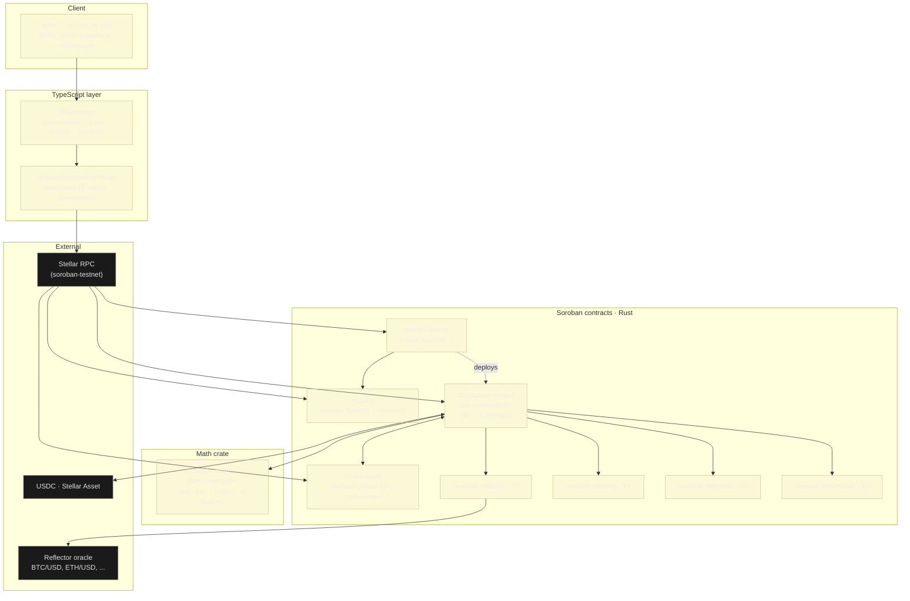

<div align="center">

# Kaido

**The first distribution-market primitive on Stellar / Soroban.**

Trade a *belief curve* `(μ, σ)` over a numeric outcome — not a yes / no share.
Payouts scale with how close your curve peaks to the realized number.

[Whitepaper](./kaido-whitepaper.md) · [Build plan](./build.md) · [ADRs](./docs/adr/) · [Test vectors](./docs/test-vectors/)

</div>

---

## What is it

A prediction market where the outcome is a **number**, not a side. Your position
is a Gaussian `(μ, σ)` over the outcome space; the AMM prices it against the
current aggregate curve using an L²-norm invariant (Uniswap's class of
constant-function AMM, lifted to a Hilbert space of probability densities, per
White, Paradigm 2024). At resolution the contract pays the height of your curve
at the realized value, scaled by your collateral. Tighter peak ⇒ bigger payout
when you're right, bigger loss when you're wrong.

Capital efficiency comes from the single-position-per-curve structure: instead
of buying dozens of binary "above X / below X" shares to express a shape, you
post one trade.

---

## Architecture



**Layer 1** is the chain side — a Soroban contract suite that holds collateral,
prices trades, and settles markets. **Layer 2** is the off-chain surface — a
Next.js app and a TypeScript SDK that compile a user's `(μ, σ)` input into the
correct calldata, quote cost / worst-case / max payout deterministically, and
display results.

---

## Repo layout

```
kaido/
├─ contracts/                     Rust / Soroban — Cargo workspace
│  ├─ crates/kaido-math/          fixed-point Gaussian math (no f64 — ADR-1)
│  ├─ packages-common/            shared Soroban types: Resolver trait, errors, events (ADR-5)
│  ├─ contracts/
│  │   ├─ market-factory/         create_market(...) entry point
│  │   ├─ distribution-market/    per-market AMM (‖f‖₂ = k invariant)
│  │   ├─ house-vault/            protocol LP / underwriter of last resort
│  │   ├─ registry/               indexes markets + resolvers
│  │   └─ resolver-{reflector,attested,optimistic,designated}/
│  ├─ tests/                      multi-contract integration tests
│  ├─ fuzz/                       cargo-fuzz targets (nightly; outside workspace)
│  └─ Makefile.toml               cargo-make tasks
│
├─ web/                           Next.js 16 (App Router)
│  ├─ app/                        landing · /markets · /create · /leaderboard · /whitepaper
│  ├─ components/                 hero, forecast, market, wallet, ui
│  └─ lib/                        stellar (networks, wallet, contracts), curve, utils
│
├─ packages/
│  ├─ sdk/                        @kaido/sdk — TypeScript SDK
│  ├─ contract-bindings/          generated TS bindings (committed; refreshed by CI)
│  └─ config/                     shared eslint / tsconfig / tailwind preset
│
├─ config/networks.json           static, public network params
├─ docs/
│  ├─ adr/                        architecture decisions (math, types, oracle, ...)
│  └─ test-vectors/               cross-language reference (mpmath, 50-digit)
├─ kaido-whitepaper.md            full mechanism + system architecture
└─ build.md                       sprint plan + SCF tranche mapping
```

---

## Prerequisites

- **Node ≥ 22** and **pnpm** (`corepack enable` or `npm i -g pnpm`)
- **Rust (stable)** via rustup — the `wasm32v1-none` target is installed
  automatically from `contracts/rust-toolchain.toml`
- **Stellar CLI** ≥ 23 — <https://developers.stellar.org/docs/tools/cli>
- **cargo-make** — `cargo install --locked cargo-make`
- **Docker** — *optional*, only for `make localnet`. Kaido develops and deploys
  against **Stellar Testnet**, which needs no Docker.

---

## Getting started

```bash
# 1. install JS deps + build all contract WASM
pnpm install
cargo make --cwd contracts build-wasm        # or: make bootstrap

# 2. env — defaults target Stellar Testnet
cp .env.example .env

# 3. a funded testnet deployer account
stellar keys generate kaido-testnet-deployer --network testnet --fund

# 4. run the web app
pnpm dev                                      # http://localhost:3000

# 5. the usual checks (same as CI)
pnpm build && pnpm lint && pnpm typecheck && pnpm test     # web
cargo make --cwd contracts ci                              # fmt + clippy + test + wasm
pnpm --filter web e2e                                      # Playwright smoke

# (optional) offline local network instead of testnet
make localnet                                 # Docker — RPC at http://localhost:8000/rpc
make localnet-stop
```

> Native Rust unit tests (`cargo make test`) use `soroban-sdk` testutils — no
> network at all. Only the integration / E2E lifecycle suites hit Testnet RPC.

---

## Networks

| Network | Passphrase | RPC |
| --- | --- | --- |
| **Testnet** *(default)* | `Test SDF Network ; September 2015` | `https://soroban-testnet.stellar.org` |
| Local *(optional, Docker)* | `Standalone Network ; February 2017` | `http://localhost:8000/rpc` |
| Mainnet | `Public Global Stellar Network ; September 2015` | third-party provider |

Static params live in [`config/networks.json`](./config/networks.json),
[`contracts/network.toml`](./contracts/network.toml) and
[`web/lib/stellar/networks.ts`](./web/lib/stellar/networks.ts). **Per-network
contract ids** (USDC SAC, Reflector feed, deployed Kaido contracts, admin
multisig, Launchtube) are never hardcoded — they're resolved at deploy time and
written by `contracts/scripts/deploy.sh` into `config/networks.<network>.json`.

> ⚠️ **Testnet resets** ~2–4×/year at 17:00 UTC (next: **2026-06-17**,
> **2026-12-16**) and wipes all state. Every deploy is scripted and idempotent;
> fixtures are re-seedable; nothing off-chain treats a testnet contract id as
> permanent.

---

## Deploying

```bash
make deploy:testnet      # scripted, idempotent; rewrites config/networks.testnet.json
make seed:testnet        # re-seed demo/test fixtures
```

Mainnet deploys are gated on the external audit + a legal opinion (see
`build.md` Sprint 8). `deploy.sh` refuses to run against mainnet until then.

---

## End-to-end flow

```mermaid
sequenceDiagram
  autonumber
  participant U as User
  participant W as web (Belief Surface)
  participant S as @kaido/sdk
  participant F as market-factory
  participant M as distribution-market
  participant O as resolver-reflector
  participant V as house-vault

  Note over F,M: One-time per market
  U->>W: open /create, set question, range, oracle
  W->>S: createMarket(...)
  S->>F: invoke create_market
  F-->>M: deploy + init(params, μ₀, σ₀)
  F->>V: register market for house liquidity

  Note over U,M: Per trade
  U->>W: set μ slider, σ slider
  W->>S: quote(μ, σ) → cost · worst · max payout
  U->>W: confirm
  W->>S: trade(market, μ, σ, collateral)
  S->>M: invoke trade; M reads kaido-math (λ-scaling, ‖f‖₂)

  Note over M,O: At resolveAt
  M->>O: resolve()
  O-->>M: x₀ (truth)
  M->>U: pay f(x₀) · collateral
  M->>V: settle house position
```

---

## Concepts

The depth lives in [`kaido-whitepaper.md`](./kaido-whitepaper.md). One-liners:

- **Distribution market** — an AMM that holds an aggregate belief curve over a
  numeric outcome. Equilibrium ⇒ truth (Cauchy–Schwarz).
- **`(μ, σ)`** — a Gaussian belief: where the number lands and how sure.
- **`‖f‖₂ = k`** — the L²-norm invariant. Same role as `xy = k`.
- **σ-floor** — the mechanism's bounded-loss guarantee. No belief can be
  sharper than `σ ≥ k² / (b²·√π)`, which caps `max f(x) ≤ b`.
- **Oracle tiers** — T0 trustless feed (Reflector), T1 attested, T2 optimistic,
  T3 designated. Every market displays its tier badge.
- **HouseVault** — protocol-owned LP that seeds new markets so a trader can
  show up minute one and trade against *something*.

---

## CI

| Workflow | What it runs |
| --- | --- |
| `.github/workflows/ci-contracts.yml` | `fmt`, `clippy -D warnings`, `cargo test`, `stellar contract build`, `cargo audit` |
| `.github/workflows/ci-web.yml` | lint, typecheck, build, Vitest, Playwright smoke |
| `.github/workflows/deploy-testnet.yml` | manual, scripted testnet deploy |

> Repo admin TODO: enable branch protection on `main` requiring both CI
> workflows to pass.

---

## License

Dual-licensed under [MIT](./LICENSE-MIT) or [Apache-2.0](./LICENSE-APACHE).
