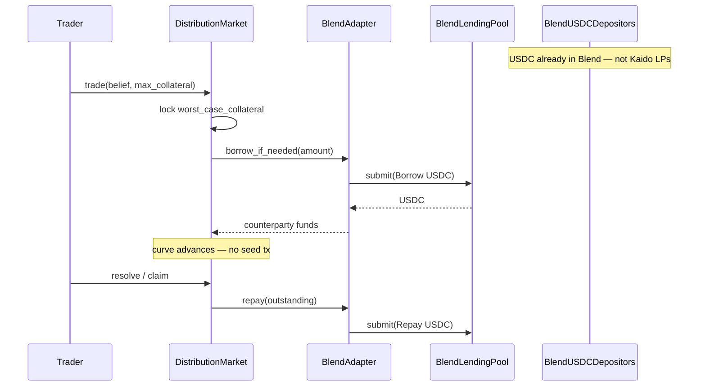

# Kaido Liquidity Plan — BlendTap (HouseVault-free)

Status: **approved direction for discussion → implementation** (June 2026)

This document supersedes the prior HouseVault-centric draft. It consolidates:

- On-chain behavior verified against the current Soroban contracts in this repo
- Session research (Colosseum Copilot + ETHGlobal hackathon patterns)
- Stellar / Blend official documentation (no mocked APIs)
- The decision to **remove `HouseVault` entirely** and bootstrap via **Blend JIT borrow**

---

## 1. Decisions (locked for this plan)

| # | Decision | Rationale |
|---|---|---|
| D1 | **Delete `HouseVault`** | Protocol-owned seeding does not scale permissionlessly; contradicts “tap existing Stellar USDC, not recruit prediction-market LPs.” |
| D2 | **BlendTap is the sole Day-1 bootstrap** | Stellar is a payments chain; USDC already sits in Blend. Borrow at trade time, repay at resolve. |
| D3 | **No vAMM / virtual depth** | Breaks Kaido’s full-collateralization story (`f(x) ≤ b`). |
| D4 | **When Blend is dry → graceful reject** | No protocol book, no treasury bailout, no HouseVault fallback. |
| D5 | **Third-party LPs remain optional** | `add_liquidity` for fee share only; never required for first trade. |
| D6 | **Product copy: “trade vs market curve”** | Retire “play vs house” / “HouseVault seeds.” |

---

## 2. The problem

Kaido’s distribution-market AMM needs counterparty capacity (`b`) so traders can move the aggregate curve `f`. Without depth, markets look empty and (under BlendTap) borrows cannot be opened.

**The constraint:**

> We will not have prediction-market LPs on Day 1. Stellar already has USDC in Blend, Soroswap, and native balances. We must use *that* — not recruit a new LP class and not operate a protocol house book.

This is **not** “how do we make LPs more profitable?” It is: **how does the first trade work on a brand-new market with zero Kaido-specific deposits?**

---

## 3. Current on-chain behavior (verified)

### 3.1 State at market creation

`DistributionMarket::init` sets `CollateralPool = 0`, `LockedCollateral = 0`. Parameter `b` is stored in `MarketParams` but no USDC is deposited.

```188:193:contracts/contracts/distribution-market/src/lib.rs
        storage.set(&DataKey::CollateralPool, &0i128);
        storage.set(&DataKey::LpTotalShares, &0i128);
        storage.set(&DataKey::FeePool, &0i128);
        storage.set(&DataKey::TreasuryFees, &0i128);
        storage.set(&DataKey::CreatorFees, &0i128);
        storage.set(&DataKey::LockedCollateral, &0i128);
```

`MarketFactory` explicitly does **not** auto-seed:

```11:13:contracts/contracts/market-factory/src/lib.rs
//! It does **not** auto-seed liquidity: `HouseVault::seed_market` is admin-gated
//! (the house is the protocol's own LP, not something a market creator can
//! conscript), so seeding stays an explicit follow-up call by the house admin.
```

### 3.2 `trade()` does not require LP USDC today

`trade()` pulls trader USDC, locks `worst_case_collateral`, advances the curve. It does **not** read `CollateralPool` or `free_collateral`.

```212:298:contracts/contracts/distribution-market/src/lib.rs
    pub fn trade(
        env: Env,
        trader: Address,
        mu2: i128,
        sigma2: i128,
        max_collateral_7dp: i128,
    ) -> u64 {
        // ... status / window / sigma checks ...
        let collateral_wad = if params.capped {
            capped_worst_case_collateral(/* ... */)
        } else {
            worst_case_collateral((g.mu, g.sigma, g.lambda), (f.mu, f.sigma, f.lambda))
        };
        // ... fee, slippage, USDC transfer_from trader ...
        storage.set(&DataKey::LockedCollateral, &(locked + collateral_wad));
        storage.set(&DataKey::Belief, &g);
        // ...
    }
```

**Implication:** A zero-LP market can still accept trades today. Solvency at `claim` is backed by **locked trader collateral** plus pool accounting — not by pre-seeded LP USDC.

### 3.3 What `b` and `free_collateral` mean

```914:923:contracts/contracts/distribution-market/src/lib.rs
    /// Free collateral available for LP entry: `b − locked − pool` (WAD).
    pub fn free_collateral(env: Env) -> i128 {
        let params: MarketParams = storage.get(&DataKey::Params).unwrap();
        let locked: i128 = storage.get(&DataKey::LockedCollateral).unwrap_or(0);
        let pool: i128 = storage.get(&DataKey::CollateralPool).unwrap_or(0);
        params.b.saturating_sub(locked).saturating_sub(pool)
    }
```

`add_liquidity` reverts with `InsufficientLiquidity` when `free_wad ≤ 0`:

```417:422:contracts/contracts/distribution-market/src/lib.rs
        let free_wad = params.b.saturating_sub(locked).saturating_sub(pool);
        if free_wad <= 0 {
            panic_with_error!(&env, KaidoError::InsufficientLiquidity);
        }
```

### 3.4 Worst-case collateral (solvency primitive)

From `kaido-math` (whitepaper §11):

```81:84:contracts/crates/kaido-math/src/gaussian.rs
/// Worst-case collateral for a trade that moves the market curve from `f` to
/// `g`: `max( 0, −min_x ( g(x) − f(x) ) )` — the largest amount the trader
/// could owe at resolution (whitepaper §11, step 3).
pub fn worst_case_collateral(g: (i128, i128, i128), f: (i128, i128, i128)) -> i128 {
```

**BlendTap thesis:** this known max loss can secure a Blend borrow (same insight as [Aqua Outcome Market](https://ethglobal.com/showcase/aqua-outcome-market-0va0j) on Euler).

### 3.5 What `HouseVault` does today (to be removed)

```135:186:contracts/contracts/house-vault/src/lib.rs
    pub fn seed_market(env: Env, market: Address, amount_7dp: i128) -> i128 {
        // admin auth, cap check ...
        let free = dm.free_collateral();
        if free <= 0 {
            panic_with_error!(&env, KaidoError::InsufficientLiquidity);
        }
        // authorize USDC transfer → market.add_liquidity(...)
    }
```

Testnet seeding today (`contracts/scripts/seed.sh`): deployer deposits USDC → `set_cap` → `seed_market` on demo/lifecycle markets. **This pipeline goes away.**

Current testnet ids (for migration reference): `config/networks.testnet.json` — `houseVault` `CCHABSAKYR2Y56DBIF5JST7PIBBXBNLELFQG23ZMPJ7UUA7KW7GYN5NY`.

---

## 4. Session research summary

### 4.1 ETHGlobal — patterns that avoid dedicated prediction-market LPs

| Project | Event | Mechanism | Link |
|---|---|---|---|
| **Aqua Outcome Market** | Buenos Aires — 1inch 1st | pm-AMM; **JIT borrow from Euler** on each swap; virtual reserves; credit-based MM | [showcase](https://ethglobal.com/showcase/aqua-outcome-market-0va0j) |
| **Basis-Zero** | HackMoney 2026 | Yield-funded counterparty; Safe Mode uses only accrued yield | [showcase](https://ethglobal.com/showcase/basis-zero-6gkde) |
| **Poorps (vAMM)** | Buenos Aires | Virtual AMM — depth without physical LPs (**rejected** for Kaido) | [showcase](https://ethglobal.com/showcase/poorps-jg27k) |
| **QU!D** | HackMoney 2026 | Virtual reserves (Bancor-style) (**rejected**) | [showcase](https://ethglobal.com/showcase/qu-d-qtr04) |
| **Orbswap Prediction** | Buenos Aires — Uniswap 2nd | Concentrated probability LP curve (LP economics, not Day-0) | [showcase](https://ethglobal.com/showcase/orbswap-prediction-hyxb2) |
| **JIT Saving Vault** | ETHGlobal NY 2025 | Uniswap v4 hook + Aave borrow before swap, repay after | [showcase](https://ethglobal.com/showcase/jit-saving-vault-uud5s) |

**Pattern:** Winners either **borrow from money markets at trade time** (Aqua) or go **virtual** (Poorps, QU!D). Kaido keeps full collateralization → borrow path.

Key Aqua quote:

> *"Just-In-Time liquidity… borrow or withdraw from a money market on demand to fulfill a swap… pull the capital necessary at the exact time it's needed."*

Stellar equivalent: **Blend** (not Euler).

### 4.2 Colosseum Copilot (Solana hackathons)

- Prediction-market cluster: **149 projects** — most use standard AMM + oracle + escrow; few innovate on bootstrap.
- Standouts: **Splash Markets** (vAMM), **Caudal** (shared liquidity launchpad), **tap2bet** (LMSR subsidy).
- Gap analysis: winners slightly overindex on `fragmented liquidity` and `capital inefficiency` as stated problems.
- **None of these replace BlendTap on Stellar** — they confirm borrow-at-trade-time and shared-spine as capital-efficiency ideas, not Day-0 Stellar USDC tap.

### 4.3 Stellar-specific verdict

On a **payments chain**, the winning approach taps existing money-market USDC (Blend), not virtual depth or a protocol house. Compose optionally with **yield-on-locked-margin** (Basis-Zero slice) to subsidize borrow APR.

---

## 5. Proposed solution: BlendTap

**One mechanism:** At trade time, Kaido borrows counterparty USDC from a Blend lending pool (JIT). At resolve/claim time, it repays from trader forfeitures and locked collateral. **Zero Kaido-specific LP deposits on Day 1. Zero HouseVault.**



### 5.1 Why Kaido’s math fits

Every trade posts **`worst_case_collateral`** upfront (σ-floor / capped Gaussians). Property tests in `contracts/contracts/distribution-market/src/test.rs` verify non-negativity and lifecycle invariants.

The Blend borrow can be secured by collateral with a **known on-chain max loss** before the borrow executes — stronger than generic binary prediction markets, which is why Aqua built a custom pm-AMM hook.

### 5.2 Reinterpret `b` under BlendTap

| Field | Today | BlendTap |
|---|---|---|
| `MarketParams.b` | Max curve mass / collateral envelope | **Max borrow capacity** (per-market cap) |
| `CollateralPool` | LP USDC (optional) | Still optional third-party LP deposits |
| `LockedCollateral` | Trader posted collateral | Unchanged |
| External | — | `outstanding_blend_debt` tracked in `BlendAdapter` |

### 5.3 Blend integration facts (official docs — not mocked)

Source: [Blend Fund Management](https://docs.blend.capital/tech-docs/core-contracts/lending-pool/fund-management.md), [Integrate with a Blend Pool](https://docs.blend.capital/tech-docs/integrations/integrate-pool.md).

**Single entrypoint:** pool contract `submit(from, spender, to, requests[])`.

**Request struct** (from Blend docs):

```rust
pub struct Request {
    pub request_type: u32,
    pub address: Address, // asset contract address
    pub amount: i128,
}
```

**Request types relevant to BlendTap:**

| Name | `request_type` | Use |
|---|---|---|
| Deposit Collateral | **2** | Post collateral before borrow (Blend requires healthy position) |
| Borrow | **4** | Draw USDC from pool |
| Repay | **5** | Return USDC + accrued interest |

**Rules from Blend docs:**

- Requests in one `submit()` are **atomic**; reverts if position would be unhealthy after all requests.
- `from` and `to` must **authorize** the `submit()` call.
- **Borrow fails** if `pool_status > 1` (Frozen or On-Ice).
- **Repay** clears accrued interest as part of liability balance.

**Available borrow liquidity** (for `available_depth()`):

- Call pool `get_reserve(env, usdc_asset) -> Reserve` (updated to current ledger).
- `available ≈ TotalSupplied - TotalBorrowed` for the USDC reserve ([Interest Rates / utilization](https://docs.blend.capital/pool-creators/adding-assets/interest-rates.md)).

**Blend testnet addresses** (from [blend-utils/testnet.contracts.json](https://github.com/blend-capital/blend-utils/blob/main/testnet.contracts.json)):

| Asset / contract | Testnet address |
|---|---|
| USDC (SAC) | `CAQCFVLOBK5GIULPNZRGATJJMIZL5BSP7X5YJVMGCPTUEPFM4AVSRCJU` |
| Pool factory V2 | `CDV6RX4CGPCOKGTBFS52V3LMWQGZN3LCQTXF5RVPOOCG4XVMHXQ4NTF6` |
| Backstop V2 | `CBDVWXT433PRVTUNM56C3JREF3HIZHRBA64NB2C3B2UNCKIS65ZYCLZA` |
| Testnet V2 pool | `CCEBVDYM32YNYCVNRXQKDFFPISJJCV557CDZEIRBEE4NCV4KHPQ44HGF` |

**Blend mainnet core** ([deployments](https://docs.blend.capital/mainnet-deployments.md)): Pool Factory `CDSYOAVXFY7SM5S64IZPPPYB4GVGGLMQVFREPSQQEZVIWXX5R23G4QSU`, Backstop `CAQQR5SWBXKIGZKPBZDH3KM5GQ5GUTPKB7JAFCINLZBC5WXPJKRG3IM7`.

**SDK:** Blend documents integration via `blend-contract-sdk` (Rust clients + WASM). Kaido should depend on the **published** SDK rather than inventing pool interfaces.

### 5.4 `BlendAdapter` — spec (not yet implemented)

New Soroban contract crate: `contracts/contracts/blend-adapter/`.

**Storage (proposed):**

- `blend_pool: Address` — target lending pool
- `usdc: Address` — USDC SAC id (same as markets; per-network at deploy)
- `admin: Address` — governance
- `authorized_markets: Map<Address, bool>` — which `DistributionMarket` instances may borrow
- `borrow_cap: Map<Address, i128>` — per-market max outstanding borrow (7-dp or WAD — match market money scale at boundary)
- `outstanding: Map<Address, i128>` — per-market debt to Blend

**Public interface (proposed):**

```rust
// Callable only by authorized DistributionMarket
fn borrow_for_market(env, market: Address, amount_7dp: i128) -> i128;
fn repay_for_market(env, market: Address, amount_7dp: i128) -> i128;

// Views
fn available_depth(env, market: Address) -> i128;  // min(cap - outstanding, pool_available)
fn outstanding_debt(env, market: Address) -> i128;
```

**Authorization pattern:** Mirror `HouseVault`’s `env.authorize_as_current_contract(...)` for sub-calls — already used when the vault authorizes USDC `transfer` into `add_liquidity`:

```179:186:contracts/contracts/house-vault/src/lib.rs
        env.authorize_as_current_contract(transfer_auth(
            &env,
            &usdc,
            &me,
            &market,
            actual_7dp,
        ));
        let shares = dm.add_liquidity(&me, &scale);
```

`BlendAdapter` will need the equivalent for `pool.submit(...)` with `from = adapter`, `to = adapter` (exact auth layout **must be confirmed in spike** against live Blend testnet pool).

### 5.5 Changes to `DistributionMarket` (proposed)

**`init` additions:**

- `blend_adapter: Address` (or optional zero = disabled for local tests without Blend)
- Store adapter address in instance storage

**`trade` path:**

1. Existing: compute `collateral_wad`, pull USDC from trader, lock collateral, advance curve.
2. **New (if counterparty USDC needed for solvency envelope):** call `BlendAdapter::borrow_for_market` up to cap.
3. **New:** pre-check `available_depth()` ≥ required borrow; revert `InsufficientLiquidity` (or new error `BlendDepthExceeded`) if not.

**`claim` / resolve path:**

- After settlement transfers, call `BlendAdapter::repay_for_market` for outstanding debt attributable to that market.

**New view:**

- `blend_backed_depth() -> i128` — delegate to adapter `available_depth`.

**Tests:** Extend property/fuzz tests in `distribution-market/src/test.rs` with borrow/repay sequences alongside existing trade/LP fuzz.

### 5.6 Phase 2 (not Day 1)

- **Belief Spine** — shared collateral across correlated markets (Caudal pattern); capital efficiency after borrow path works.
- **Soroswap LP → Blend collateral** — lease DEX liquidity (Aqua credit-MM pattern).
- **Yield-on-locked-margin** — park locked trader USDC in Blend; accrued yield subsidizes borrow APR ([Basis-Zero](https://ethglobal.com/showcase/basis-zero-6gkde)).

---

## 6. Empty pool — scenarios and fixes (HouseVault-free)

| Scenario | Symptom | Fix |
|---|---|---|
| **A — Cold start** | $0 LP pool, new market | **BlendTap**; UI shows `Blend-backed depth` |
| **B — Full capacity** | `free_collateral = 0` | Claims unlock locked; raise borrow cap; Belief Spine (P2); optional third-party LPs |
| **C — LPs exited** | `CollateralPool = 0`, positions open | `worst_case_collateral` + claim accounting; BlendTap repay at resolve; LP fee incentives |
| **D — Blend dry** | `available_depth ≈ 0` | Pre-trade revert; UI “liquidity low”; yield-on-margin (P2); **accept pause** — no vault bailout |
| **E — Settlement** | Should not happen | σ-floor, capped Gaussians, fuzz proofs, `Disputable` on stale oracle |

**Critical:** Without HouseVault, **Scenario D is the primary production failure mode.** Product must handle it honestly.

---

## 7. Rejected approaches

| Idea | Why rejected |
|---|---|
| **HouseVault** | Protocol book; manual seeding; removed by D1 |
| **Belief Spine alone** | Fixes fragmentation, not t=0 bootstrap |
| **Mesh vault + keeper router** | Still needs vault depositors |
| **AIMM agents** | Agents need capital; off-chain |
| **vAMM (Poorps/Splash)** | Virtual depth vs full collateralization |
| **LMSR / treasury subsidy** | Same capital problem as HouseVault |
| **Auto-seed + UI badges** | Symptoms without USDC source |

---

## 8. HouseVault removal checklist

| Area | Action |
|---|---|
| `contracts/contracts/house-vault/` | Delete crate |
| `contracts/scripts/seed.sh` | Remove `seed_house_vault`; tests use trader-funded trades only |
| `contracts/tests/tests/lifecycle.rs` | Remove house seed step |
| `config/networks.*.json` | Remove `houseVault` contract + fixture |
| `deploy.sh` | Stop deploying house-vault |
| `web/lib/stellar/house.ts` | Remove |
| `web/components/hero.tsx`, market UI | Remove house exposure / seed copy |
| `packages/contract-bindings/src/house-vault/` | Remove after redeploy |
| `kaido-whitepaper.md` §18, §20 | Rewrite: BlendTap bootstrap, “trade vs market curve” |
| `build.md` | Update pivot note (HouseVault → BlendTap) |
| `KaidoError::CapExceeded`, `CapNotSet` | Remove or repurpose when house-vault deleted |

**Regulatory narrative (was HouseVault-as-LP):** Kaido is a **Blend borrower** using existing DeFi infrastructure; optional third-party LPs earn fees; no protocol house book.

---

## 9. Open questions (must resolve in spike)

### 9.1 Blend integration

- [ ] Confirm `submit()` auth layout for a Soroban contract borrower on testnet pool `CCEBVDYM32YNYCVNRXQKDFFPISJJCV557CDZEIRBEE4NCV4KHPQ44HGF`.
- [ ] **Collateral requirement:** Blend docs state borrow requires posted collateral. Spike: bundle `Deposit Collateral (2)` + `Borrow (4)` atomically, using trader-locked USDC as collateral source.
- [ ] **Borrow model:** flash per trade vs hold borrow until market resolves?
- [ ] **Interest:** who pays borrow APR — trader fee, treasury, or yield-on-locked-margin?
- [ ] **Decimals:** Blend reserve amounts vs Kaido 7-dp USDC boundary — exact conversion rules.

### 9.2 Solvency under borrow

- [ ] Formal invariant: `outstanding_blend_debt + max_winner_payout ≤ locked_trader_collateral + collateral_pool` at all times?
- [ ] Extend property tests beyond current `worst_case_collateral` proofs.
- [ ] Peak winner payout across multiple open positions before resolve.

### 9.3 Product

- [ ] Is graceful reject when Blend dry acceptable vs always-on depth?
- [ ] Blend partnership / audit path before mainnet?

---

## 10. Success criteria

| Metric | Target |
|---|---|
| First trade on fresh market | Same tx as trade — **no seed tx**, no HouseVault |
| Kaido-specific LP deposits (first 30 days testnet) | Zero required |
| Blend utilization from Kaido | Measurable increase |
| Solvency | Existing property tests + borrow/repay fuzz pass |
| HouseVault | Not deployed |

---

## 11. Implementation order

1. **Spike:** `blend-contract-sdk` + testnet pool `submit(Borrow/Repay)` from throwaway Soroban contract ([Blend testnet addresses §5.3](#53-blend-integration-facts-official-docs--not-mocked)).
2. **`BlendAdapter` crate:** caps, authorized callers, `available_depth`, outstanding debt ledger.
3. **`DistributionMarket` integration:** trade/claim borrow lifecycle + pre-trade depth check.
4. **Property tests + fuzz:** borrow sequences in `distribution-market/src/test.rs`.
5. **Remove HouseVault:** crate, deploy, seed.sh, bindings, UI.
6. **SDK + UI:** `blend_backed_depth` display; remove empty-pool / house blockers.
7. **Whitepaper + build.md** updates.
8. **Phase 2:** Belief Spine, Soroswap collateral path, yield-on-margin.

---

## 12. References

### Kaido repo

- [`contracts/contracts/distribution-market/src/lib.rs`](contracts/contracts/distribution-market/src/lib.rs)
- [`contracts/contracts/market-factory/src/lib.rs`](contracts/contracts/market-factory/src/lib.rs)
- [`contracts/contracts/house-vault/src/lib.rs`](contracts/contracts/house-vault/src/lib.rs) — **to be deleted**
- [`contracts/crates/kaido-math/src/gaussian.rs`](contracts/crates/kaido-math/src/gaussian.rs)
- [`contracts/scripts/seed.sh`](contracts/scripts/seed.sh)
- [`kaido-whitepaper.md`](kaido-whitepaper.md)
- [`build.md`](build.md)

### External

- [Aqua Outcome Market](https://ethglobal.com/showcase/aqua-outcome-market-0va0j) (ETHGlobal Buenos Aires)
- [Basis-Zero](https://ethglobal.com/showcase/basis-zero-6gkde) (HackMoney 2026)
- [Blend — Fund Management](https://docs.blend.capital/tech-docs/core-contracts/lending-pool/fund-management.md)
- [Blend — Integrate with a Pool](https://docs.blend.capital/tech-docs/integrations/integrate-pool.md)
- [Blend — Mainnet deployments](https://docs.blend.capital/mainnet-deployments.md)
- [Blend — Testnet contracts JSON](https://github.com/blend-capital/blend-utils/blob/main/testnet.contracts.json)
- [Stellar — Blend & Meru case study](https://stellar.org/case-studies/meru-wallet-uses-blend-defi-protocol-for-yield-v2)
- [Paradigm — Distribution markets](https://www.paradigm.xyz/2024/12/distribution-markets)

---

## 13. Changelog

| Date | Change |
|---|---|
| 2026-06 (prior draft) | HouseVault bootstrap + ETHGlobal survey |
| 2026-06-26 | **This revision:** HouseVault removal; BlendTap sole bootstrap; empty-pool matrix; verified contract citations; Blend API from official docs; Colosseum/ETHGlobal session synthesis |
