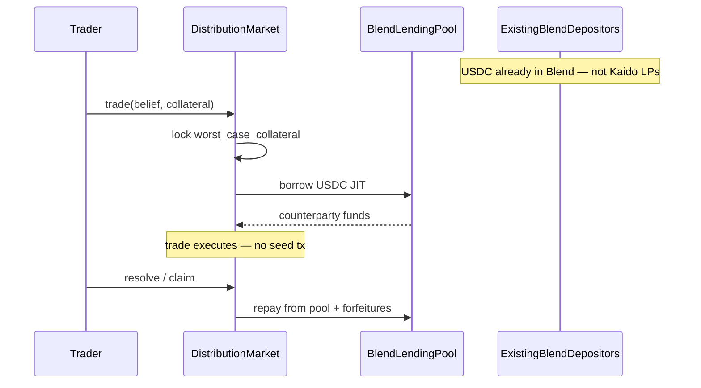

# Kaido Liquidity Plan — Discussion Doc

Status: **draft for discussion** (June 2026)

This document captures the liquidity problem, ideas we considered and rejected, ETHGlobal research, and the current proposal. It is meant to be debated before any implementation work.

---

## 1. The problem

Kaido's distribution-market AMM needs counterparty collateral (`b`) in each market pool. Without it, traders cannot place beliefs — there is nothing on the other side of the curve.

**Today:**

- Each [`DistributionMarket`](contracts/contracts/distribution-market/src/lib.rs) holds its own isolated USDC pool.
- [`HouseVault`](contracts/contracts/house-vault/src/lib.rs) seeds markets manually (admin-gated, per-market caps).
- [`MarketFactory`](contracts/contracts/market-factory/src/lib.rs) does not auto-seed — new markets can be empty until an admin runs `seed_market`.
- Third-party LPs must discover each market and call `add_liquidity` individually.

**The constraint we keep coming back to:**

> We will not have prediction-market LPs on Day 1. Stellar already has USDC liquidity in Blend, Soroswap, and native balances. We need to use *that* — not recruit a new LP class.

This is different from "how do we make LPs more profitable?" The question is: **how does the first trade work on a brand-new market with zero Kaido-specific deposits?**

---

## 2. What the whitepaper assumes today

[`kaido-whitepaper.md`](kaido-whitepaper.md) §18 describes `HouseVault` as the protocol-owned underwriter of last resort:

- Seeds every new market so a player can trade minute one.
- Risk-capped per market.
- House withdraws as third-party LPs arrive.

[`build.md`](build.md) notes HouseVault seeding in `seed.sh` and treats LP economics as a future epic. The mechanism works on testnet when someone manually funds the vault — but it does not solve **permissionless market creation at scale** or **Day 1 on mainnet without a funded house**.

---

## 3. Ideas we considered (and why they fail the Day 1 constraint)

### 3.1 Belief Spine — one pool per phenomenon

**Idea:** Instead of per-market pools, one collateral spine per outcome space (e.g. all BTC close markets share one USDC pool). New markets are "windows" on an already-funded spine.

**Pros:** Capital-efficient across correlated markets; structurally unique to continuous distribution AMMs (Polymarket cannot copy).

**Why it fails Day 1:** Someone still has to deposit into the spine. It solves fragmentation across markets, not the bootstrap problem.

### 3.2 Mesh vault + demand router

**Idea:** Single vault; LPs deposit once; off-chain keeper routes USDC to thin markets via `add_liquidity`.

**Why it fails Day 1:** Still requires vault depositors. A Soroswap with extra steps.

### 3.3 AI market makers (AIMM-style)

**Idea:** Autonomous agents price and seed long-tail markets using oracles and sentiment.

**Reference:** [AIMM](https://ethglobal.com/showcase/aimm-ajcan) (ETHGlobal Buenos Aires — Pyth 2nd, Chainlink CRE winner).

**Why it fails Day 1:** Agents still need capital to post. Off-chain band-aid, not a primitive change.

### 3.4 Auto-seed + fee multipliers + UI badges

**Idea:** Auto-call `HouseVault::seed_market` on create; boost LP fees on thin markets; show "needs liquidity" on cards.

**Why it fails Day 1:** Symptoms of empty pools. Does not create depth without a funded HouseVault.

### 3.5 Yield vaults (Basis-Zero-style)

**Idea:** USDC earns yield in a vault; only yield funds early counterparty risk.

**Reference:** [Basis-Zero](https://ethglobal.com/showcase/basis-zero-6gkde) (HackMoney 2026).

**Partial fit:** Good optimization for collateral already in the system. Still needs a seed deposit or external yield source at t=0.

---

## 4. ETHGlobal research — prediction markets & liquidity

Searched 80+ projects via [ETHGlobal skills API](https://ethglobalskills.vercel.app). Relevant winners for **tapping existing liquidity without new LPs**:

| Project | Event / prize | Mechanism | Link |
|---|---|---|---|
| **Aqua Outcome Market** | Buenos Aires — 1inch 1st | pm-AMM; **JIT borrow from Euler** on each swap; virtual reserves across markets; credit-based MM | [showcase](https://ethglobal.com/showcase/aqua-outcome-market-0va0j) |
| **Basis-Zero** | HackMoney 2026 | Yield-funded counterparty; Safe Mode bets only accrued yield | [showcase](https://ethglobal.com/showcase/basis-zero-6gkde) |
| **Poorps (vAMM)** | Buenos Aires | Virtual AMM — depth without physical LPs; collateral vault for settlement | [showcase](https://ethglobal.com/showcase/poorps-jg27k) |
| **QU!D** | HackMoney 2026 | Virtual reserves (Bancor-style) — LP without holding full inventory | [showcase](https://ethglobal.com/showcase/qu-d-qtr04) |
| **Orbswap Prediction** | Buenos Aires — Uniswap 2nd | Concentrated probability LP curve; asymmetric payoff | [showcase](https://ethglobal.com/showcase/orbswap-prediction-hyxb2) |

**Pattern:** The projects that avoid recruiting prediction-market LPs either **borrow from money markets at trade time** (Aqua) or use **virtual curves + collateral vaults** (Poorps, QU!D). Kaido's fully collateralized trades fit the borrow path better than going virtual (we want to keep `f(x) ≤ b` solvency proofs).

**Aqua Outcome Market** is the closest template. Key quote from their submission:

> *"Just-In-Time liquidity… borrow or withdraw from a money market on demand to fulfill a swap… pull the capital necessary at the exact time it's needed and underwrite outcome tokens in response to actual demand."*

They built on Euler (Ethereum). Stellar's equivalent is **Blend**.

---

## 5. Proposed solution: BlendTap

**One mechanism:** At trade time, Kaido borrows counterparty USDC from Blend (JIT). At resolve time, it repays from trader forfeitures and locked collateral. **Zero dedicated prediction-market LPs on Day 1.**

### 5.1 Why Kaido's math makes this plausible

Every trade posts **`worst_case_collateral`** upfront, bounded by σ-floor / capped Gaussians. Property tests in [`distribution-market/src/test.rs`](contracts/contracts/distribution-market/src/test.rs) verify solvency.

The Blend borrow is secured by collateral with a **known on-chain max loss** before the borrow executes. Most binary prediction markets do not have this property — which is why Aqua had to build a custom pm-AMM hook rather than plug into Polymarket directly.

### 5.2 Day 1 comparison

| Today | BlendTap |
|---|---|
| Admin seeds each market via HouseVault | `b` = borrow cap, not pre-deposited USDC |
| Empty until seed confirms | First trader gets depth in one tx |
| Recruit Kaido LPs | Blend depositors are passive LPs (higher utilization) |
| USDC idle in Kaido pools | USDC stays in Blend until a trade pulls it |

### 5.3 Ecosystem pitch (Stellar, not prediction-market natives)

> "Kaido is a Blend utilization sink. Belief trades borrow USDC from the lending pool and repay at resolution. Blend depositors earn more yield without opting into prediction markets."

### 5.4 Architecture sketch

**New: `BlendAdapter` Soroban contract**

- `borrow(amount)` / `repay(amount)` against Blend USDC pool.
- Per-market `borrow_cap` (governance).
- `available_depth()` = min(Blend liquidity, cap − outstanding borrow).
- Callable only by authorized `DistributionMarket` instances.

**Changes to `DistributionMarket`**

- `init`: `b` reinterpreted as max borrow capacity; `CollateralPool` may start at 0.
- `trade`: after locking trader collateral → borrow from Blend if counterparty needs USDC.
- `claim` / resolve path: repay outstanding Blend debt.
- Extend property tests for borrow/repay sequences and cap exhaustion.

**UI / SDK**

- Show **"Blend-backed depth: $X"** instead of empty LP pool.
- Defer standalone LP deposit UX until explicit LPs are wanted for fee share.

**Phase 2: Soroswap LP tokens via Blend collateral**

- Soroswap LPs deposit LP tokens into Blend → borrow USDC → backs Kaido.
- DEX LPs never unstake; they lease liquidity through Blend ([Aqua credit-based MM](https://ethglobal.com/showcase/aqua-outcome-market-0va0j) pattern).

**Optional (same thesis, not a second system): yield on locked margin**

- Park locked trader collateral in Blend while positions are open ([Basis-Zero](https://ethglobal.com/showcase/basis-zero-6gkde) pattern).
- Accrued yield subsidizes borrow cost early on.

### 5.5 What happens to HouseVault?

Not deleted — **demoted from bootstrap to optional top-up**:

- Useful if Blend utilization is high or borrow caps are conservative.
- Protocol can still deposit explicit LP capital for fee capture.
- No longer on the critical path for first trade.

---

## 6. Risks and open questions (for discussion)

### 6.1 Blend integration

- [ ] Does Blend on Soroban expose borrow/repay in a form Kaido can call atomically inside `trade`?
- [ ] Flash-loan style (borrow + trade + repay same tx) vs persistent borrow until resolve?
- [ ] Borrow interest: who pays — trader fee, protocol treasury, or yield-on-locked margin?

### 6.2 Solvency under borrow

- [ ] Exact invariant: `outstanding_blend_debt + max_winner_payout ≤ locked_trader_collateral + collateral_pool` at all times?
- [ ] Need formal proof extension beyond current `worst_case_collateral` tests.
- [ ] What happens if multiple winners exhaust pool before resolve — can borrow cover peak `f(x₀)` across positions?

### 6.3 Blend liquidity crunch

- [ ] If Blend USDC utilization is already high, `available_depth()` may be near zero.
- [ ] Mitigation: per-market caps, graceful rejection, HouseVault as emergency top-up.
- [ ] Is this acceptable product-wise vs always-on depth?

### 6.4 Regulatory / narrative

- [ ] Framing: Kaido is a **Blend borrower** using existing DeFi infrastructure, not a house book.
- [ ] Does Blend partnership / listing require coordination with Blend team?

### 6.5 Virtual AMM alternative

- [ ] [Poorps vAMM](https://ethglobal.com/showcase/poorps-jg27k) achieves "no LPs" with virtual curves — should Kaido ever go virtual?
- [ ] Current position: **no** — distribution market whitepaper promises full collateralization; virtual depth breaks that promise unless carefully redesigned.

### 6.6 Belief Spine — revisit later?

- [ ] Spine + BlendTap may compose: spine for cross-window capital efficiency, Blend for Day 0 bootstrap.
- [ ] Not needed for first trade; worth revisiting once borrow path works.

---

## 7. Success criteria

| Metric | Target |
|---|---|
| First trade on fresh market | Same tx as market creation — no seed tx |
| Kaido-specific LP deposits (first 30 days testnet) | Zero required |
| Blend utilization from Kaido | Measurable increase (proves ecosystem tap, not LP recruitment) |
| Solvency | All existing property tests pass + borrow/repay fuzz |

---

## 8. Implementation order (if we agree)

1. **Spike:** Blend Soroban borrow/repay from a throwaway contract on testnet.
2. **`BlendAdapter`:** borrow cap, `available_depth`, authorized callers.
3. **`DistributionMarket` integration:** trade/resolve borrow lifecycle + solvency checks.
4. **Property tests + fuzz:** borrow sequences alongside existing trade/LP fuzz.
5. **SDK + UI:** Blend-backed depth display; remove empty-pool blocker on trade path.
6. **Phase 2:** Soroswap LP collateral path; yield-on-locked margin.

---

## 9. Decisions needed

Please comment inline or in issues:

1. **Go / no-go on BlendTap** as the Day 1 liquidity primitive (vs keep HouseVault-only bootstrap for M1).
2. **Borrow model:** flash per trade vs hold borrow until market resolves.
3. **Who pays borrow APR** and whether yield-on-locked margin is in scope for v1.
4. **HouseVault role:** deprecate bootstrap entirely or keep as fallback.
5. **Blend partnership:** pursue official integration / audit path before mainnet?

---

## 10. References

- Kaido whitepaper §12 (LP math), §18 (HouseVault): [`kaido-whitepaper.md`](kaido-whitepaper.md)
- Build status / HouseVault seeding: [`build.md`](build.md)
- Distribution market contract: [`contracts/contracts/distribution-market/src/lib.rs`](contracts/contracts/distribution-market/src/lib.rs)
- ETHGlobal Aqua Outcome Market: https://ethglobal.com/showcase/aqua-outcome-market-0va0j
- ETHGlobal Basis-Zero: https://ethglobal.com/showcase/basis-zero-6gkde
- Paradigm distribution markets (mechanism Kaido implements): https://www.paradigm.xyz/2024/12/distribution-markets
